## Problem Scenario

The BFSI sector is a heavily regulated one where the players need to change their products/ processes as per the rules set out by the regulators. This coupled with ever-changing consumer preferences and economic conditions means that the players need to be agile in which they make the products available to consumers.
For example, in this post covid world, the repeated increase in the repo rates by the central banks has provided a unique opportunity for the banks to increase the rate of interest on loans and similarly provide an increased rate of returns on Fixed Deposits.  Consider the following example

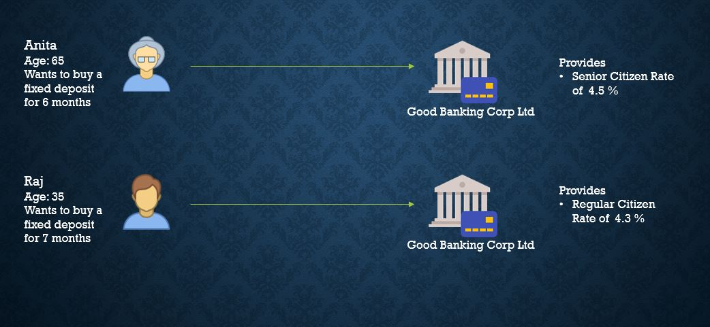

This can be implemented using the imperative programming model as

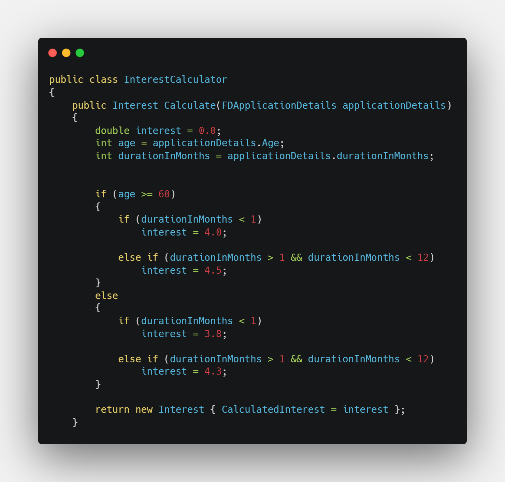

This model can be good when the logic/ business rules are not changing frequently but becomes cumbersome when agility is required. For the FD example, this approach limits agility because it tightly couples the business rules to the implementation. So every time the bank wants to revise the FD rates, the change needs to flow through change management, development lead times, and project costs. Redeployment is always required. Code maintenance becomes difficult when the number of rules is large.

## Agile Alternative

[Business Rules Engine](https://en.wikipedia.org/wiki/Business_rules_engine)(BRE) presents an alternative way of programming business rules using the Condition and Action Paradigm. For the FD example, the business rules can be pseudo-represented as shown below

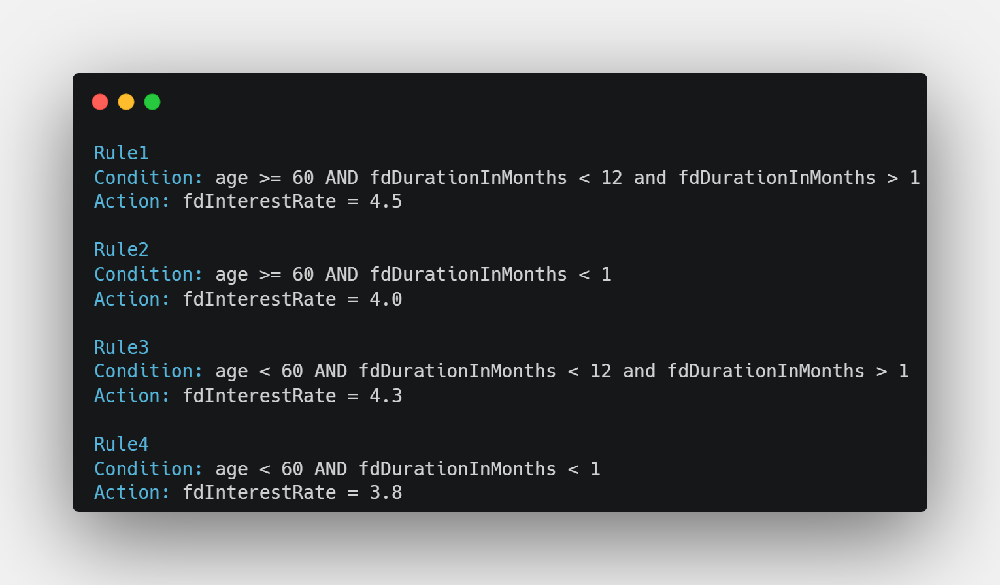

To understand how this approach provides agility, let us first understand the architecture of a typical business rules engine system.

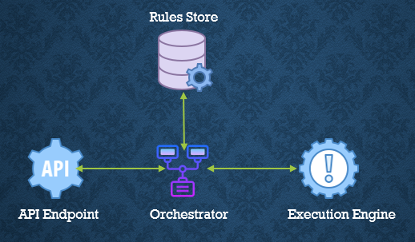

The system has 
1. *The Rules Store*: Stores the business rules written using the paradigm discussed earlier
2. *The Execution Engine*: Executes the rules on the data ingested and provides the execution result
3. *The Orchestrator*: Accepts data through its API, retrieves the rules from the store and feed them to the execution engine, and relays the execution results

The design pattern provides various benefits
1. The business rules are externalized in the rules store. Any change required in the business rules only requires an update to the configuration file in the rules store
2. The execution engine is completely decoupled from rules and does not require redeployment
3. The orchestrator can be exposed through API to support real-time processing but can also support batch processing.

These benefits make the system simpler, configurable, and highly agile.

## Azure Implementation
The following image shows a serverless stateless implementation of the Business Rules Engine System using various Azure Services
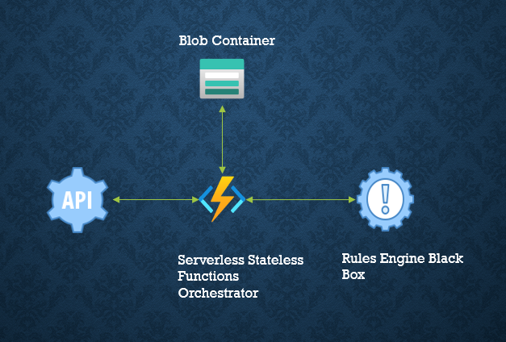

Let's now visit each of the components briefly and look at important code snippets from the implementation(Source Code Provided Later). 

{}
The implementation uses .Net 6 as the framework and C# as the language of choice.
{}

### Rules Engine

Microsoft provides an open-source [Business Rules Engine](https://microsoft.github.io/RulesEngine/) which allows us to externalize the rules configuration file into a store and provides a decoupled execution engine.  The pseudo rules that we discussed earlier can be implemented as a JSON workflow as shown below.

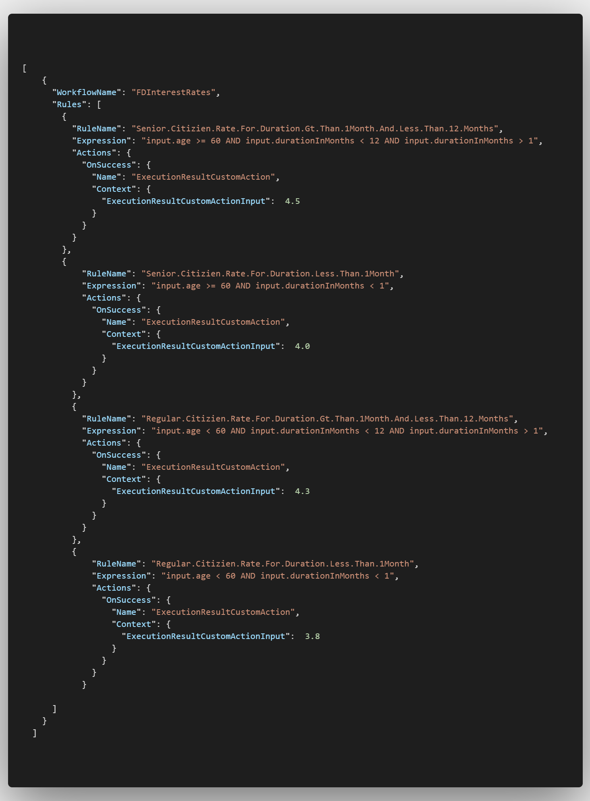

The JSON structure makes it very easy to change the rule as required. The rules engine library makes it easy to add customizations, the `ExecutionResultCustomAction` is implemented as follows ([Read More](https://microsoft.github.io/RulesEngine/#custom-actions))

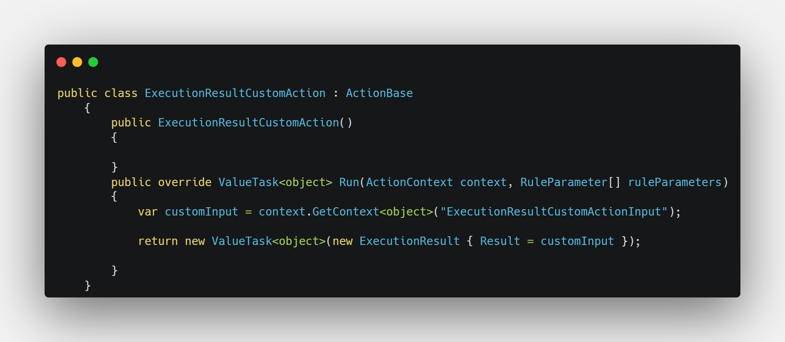

The rules can be executed using the `ExecuteRulesAsync` Method of the library as shown in the method of the same name in the `RulesEngineHandler` class.

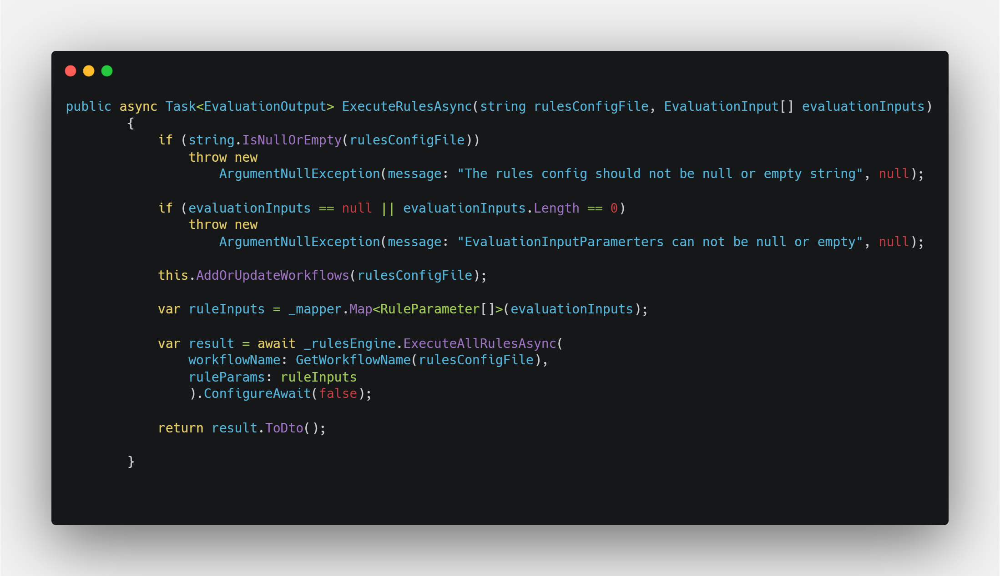

The method
1. Accepts the rules configuration JSON as a string and an array of evaluation inputs on which the rules will be executed
2. Runs certain sanity checks and throws exceptions if they are not met
3. Adds the workflow to the rules engine memory
4. Maps the evaluationInputs to the inputs expected by the rules engine
5. Evaluates the rules against the inputs
6. And finally transforms the rules execution result to the EvaluationOutput and returns the response

The `result.ToDto()` uses an extension method defined specifically on the rules engine execution output. The implemented method is as follows

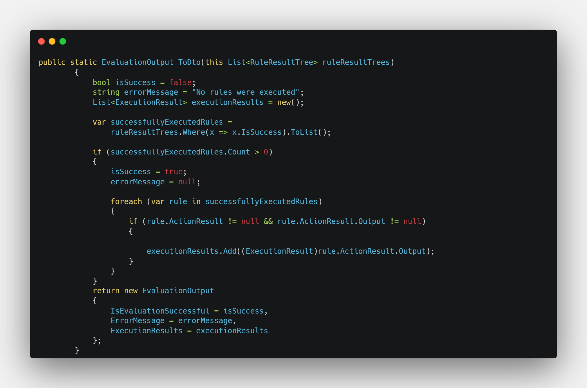

### Blob Storage

Azure Blob Storage is Microsoft’s object storage solution for the cloud. It is optimized for storing massive amounts of unstructured data and can be used to store data that can be used for various use cases like video rendering, serving images, log files, VM discs, etc.  The current design uses the container in the storage account to store the JSON version of the rules configuration file. The following code snippet of the BlobRulesStoreRepository shows how the [Blob Storage SDK](https://www.nuget.org/packages/Azure.Storage.Blobs/) can be used to download the JSON rules configuration file.

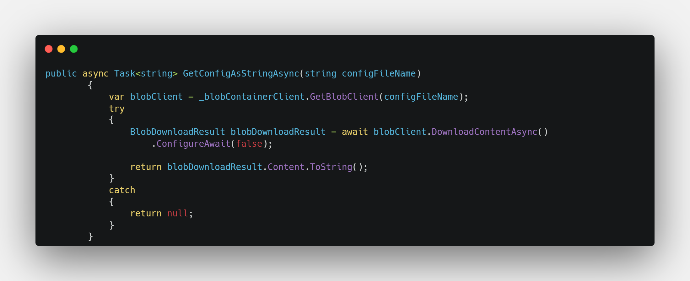

### Azure Functions

Azure functions is a cloud service available on demand that provides the capability to run custom-made pieces of code and the functions platform provides all latest and greatest in infrastructure and security.  This implementation uses Azure Functions 4.0 version and .NET 6.

The logical flow of the orchestrator of this implementation is shown below.

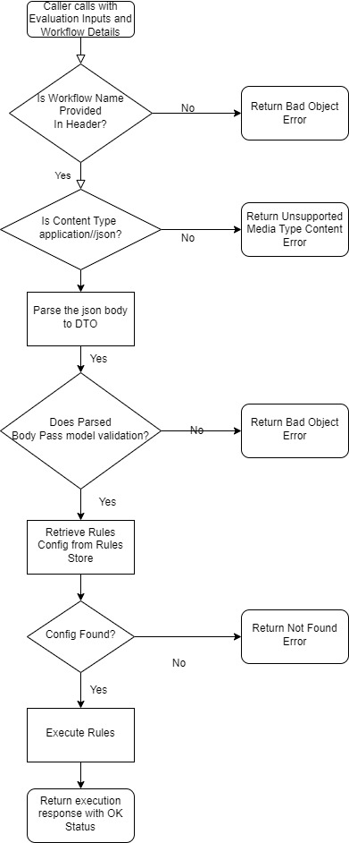

The Azure Function uses dependency injection to manage the runtime dependencies. The dependencies are registered in the Startup class as shown in the following code snippet.

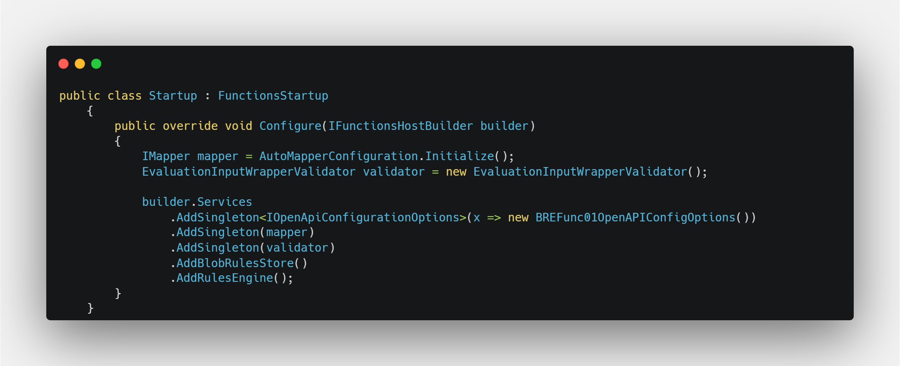

The `AddBlobRulesStore` and `AddRulesEngine` are extension methods written to extend the `IServiceCollection` implementation

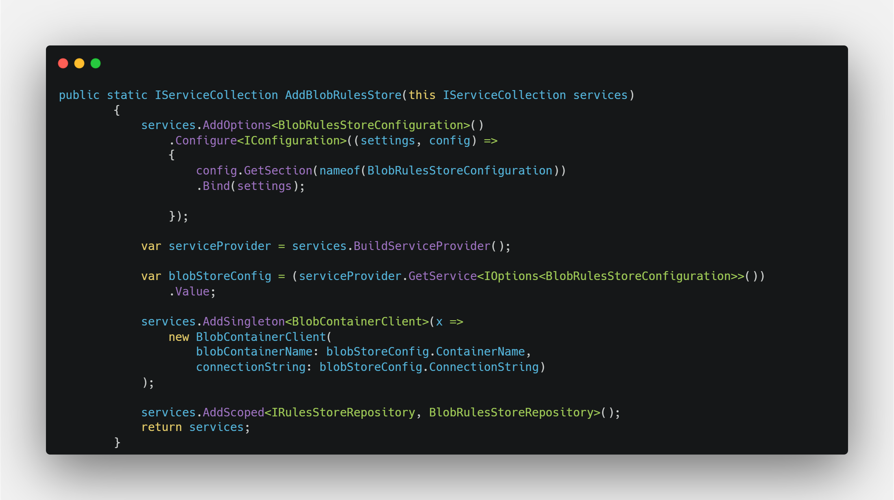

### Open API Documentation

AzureFunctions 4.0 supports open API documentation through the use of [Microsoft.Azure.WebJobs.Extensions.OpenApi](https://www.nuget.org/packages/Microsoft.Azure.WebJobs.Extensions.OpenApi) NuGet package. The Open API specs are enabled on an Azure function using the decorators on the function signature. The Decorators, in this case, are shown below.

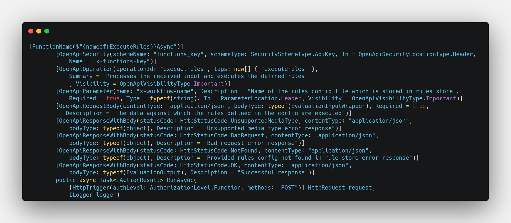

The resultant OpenAPI specification looks as follows.

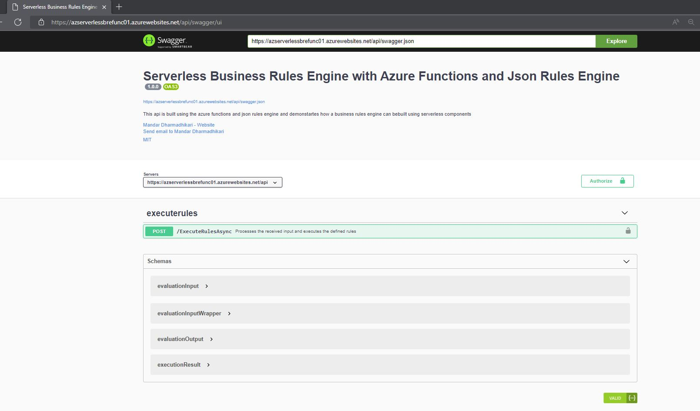

## Scalability Of Azure Implementation

The solution contains mainly two deployable assets
1. *Blob Storage Account*: This component can be scaled as required because it is managed by Azure and is designed for scale.
2. *Azure Functions*: Azure Functions support different deployment models, some of the common ones are the consumption plan, app service plan, and containerized plan. Each of these plans has different scalability models. For example, the consumption plan can be scaled dynamically according to the load on the functions. The app service plan can be scaled in or out using metrics-based scaling where we can define the metrics conditions which can upgrade or downgrade the app service plan as required.

## Testing

Testing the rules is simple. All we need to do is invoke the Functions REST endpoint and pass it to the relevant data. The following image shows a sample request response sent to the API.

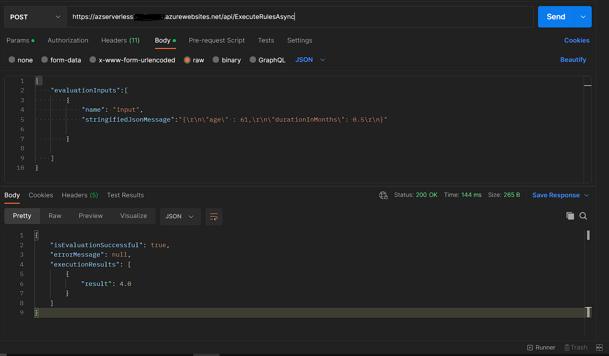

## Pros and Cons of BRE Approach

As seen from the above implementation, the Pros of the BRE approach are clear
1. Simplicity, High Configurability of the Rules
2. Decoupling of rules and execution
3. High Scalability as per requirement

While the Pros are many, one of the major disadvantages of using BRE is *the change in the coding paradigm for the business rules*. Developers need some time to get used to the new approach as the decision path is not visible when compared to the imperative programming model.

## Conclusion

After going through the rules engine implementation, we can conclude that Rules Engine Implementation does provide agility to the organization to implement business process decisions. But, the rules engine needs careful evaluation as a simple system of rules can be easily developed using the imperative model and maintained accordingly.

## Source Code

The source code for the implementation discussed in this blog can be found at [Rules Engine With Azure Functions and MS Rules Engine](https://github.com/codidharma/az-func-bre)
