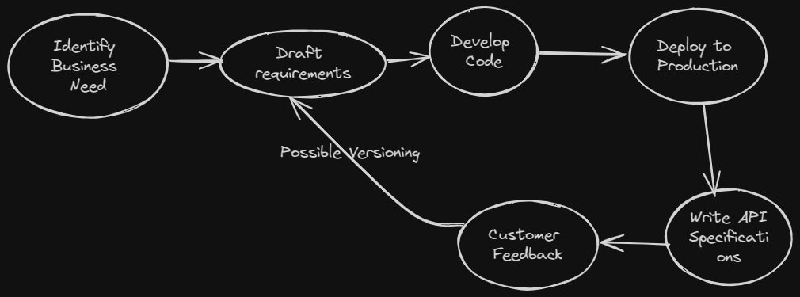
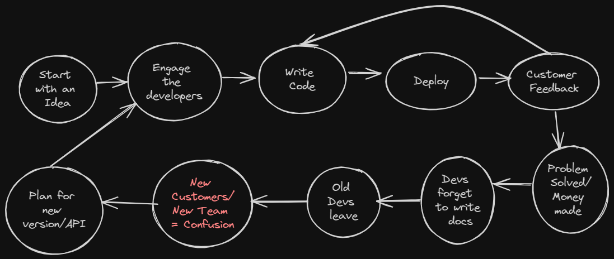
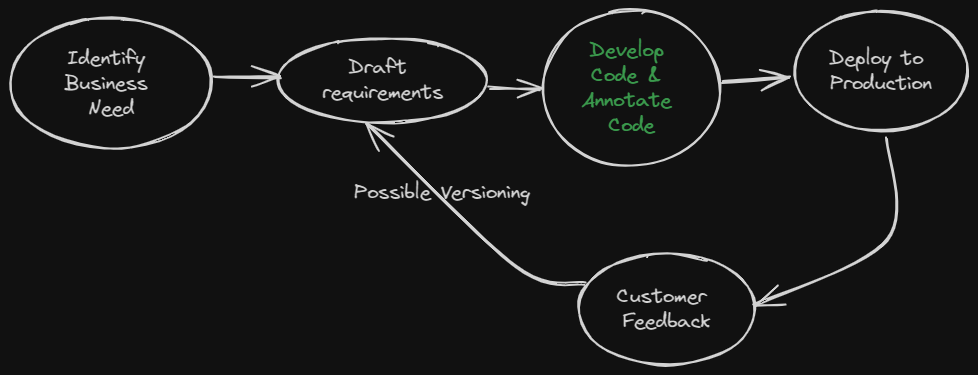
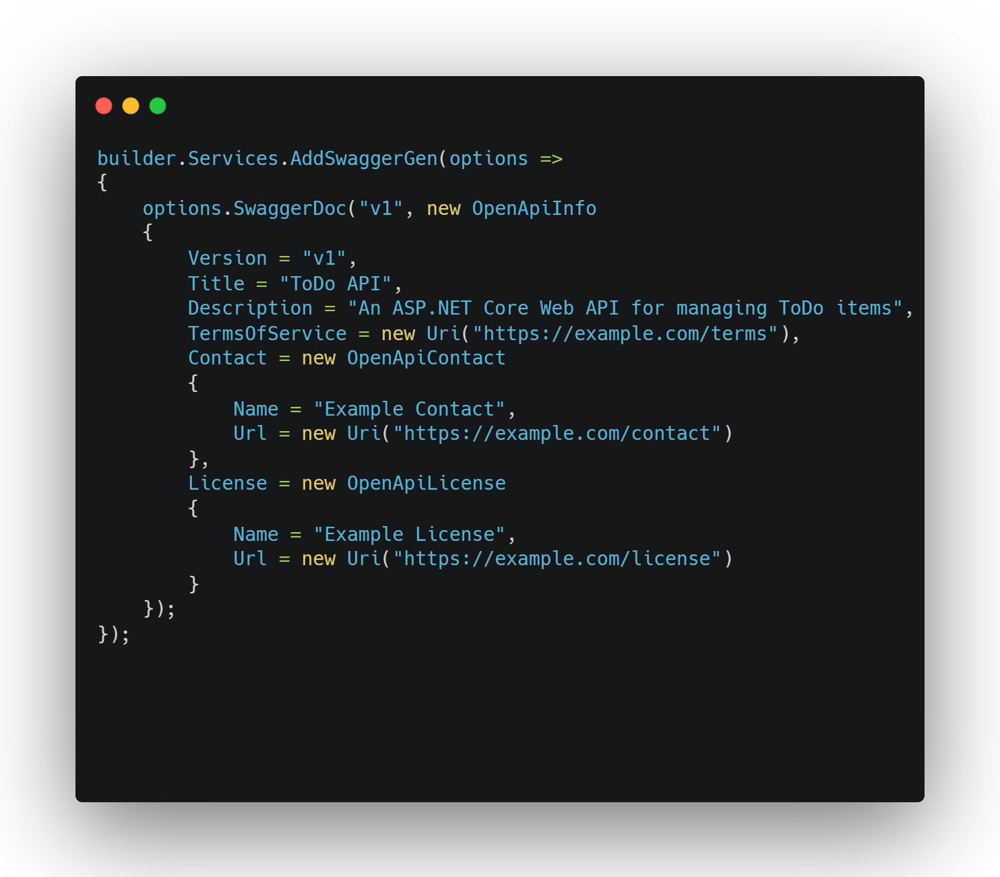
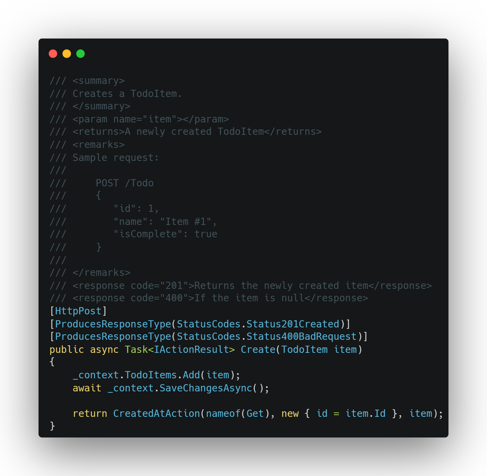
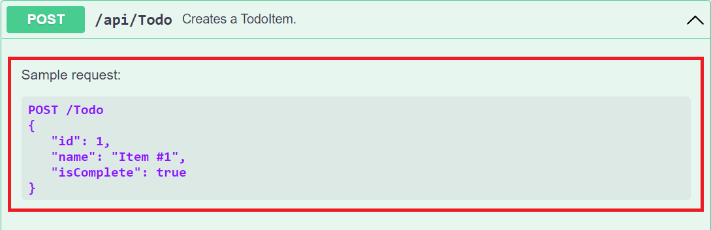
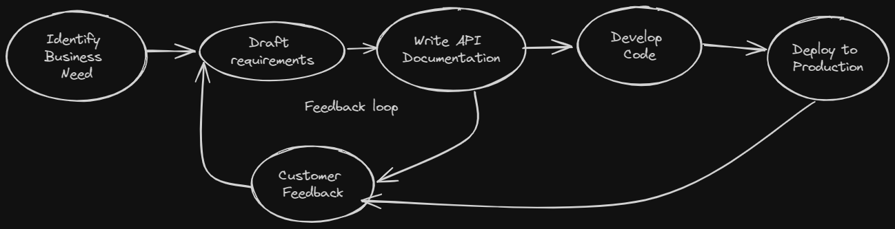

Welcome to the first ever edition of the `Codidharma Weekly`. Today we will discuss about a topic which intersects across software architecture, development and management. Today we try to analyze the questions that many of us have faced or will face during the course of career.
`What is the correct way to build an API? Design First or Code First?` or is a question without a definitive answer? Without further ado lets dive into understanding the bits and bobs of the process.

When it comes to designing [Web APIs](https://en.wikipedia.org/wiki/Web_API), there are two approaches that have strong proponents,

1. The Code-First
2. The Design-First

## What is Code-First approach for API design?

This is a classic approach to API development which can be described with following diagram

This process has certain advantages.

1. **High Initial Velocity**: Since there is no documentation that the developers need to do, they can focus on what brings the value
2. **Faster Go to market**: With the code first approach, the developers can release APIs to the production quickly and make them available for customer feedback.

This looks very promising right?? Delivering value from the beginning. But here comes the problem which I will enunciate with my past experience.

### Code-First done the wrong way!

When I was a mid level engineer and just getting into software architecture and systems design, I came onboard a project where the API program was being run in a rather unconventional manner. The entire suite of APIs that were productionized were being written off with a newer version from scratch. Not to say the story left me scratching my head!

When I spoke with developers, managers in the org, I came across a story which can be summed up with following statesque diagram.

The developers never wrote the documentation for the APIs and ran into all sorts of problem.

Which leads me to the shortcomings of this approach

1. **Documentation Gaps**: The documentation for the API can lag behind the changes that are being made to the functionality or as highlighted above can be non existent.
2. **Collaboration Gaps**: Since there is improper/no documentation maintained, there will be communication gaps betweeen the Business analysts, the Developers(amongst themselves) and the QA folks. The will not be able to speak a common domain language.
3. **QA Issues**: The lack of documentation on how to test the API, the resources and the functionality they offer will result in bad consumer experience and will hamper the quality in the long run
4. **Longer Feedback loop**: The feedback loop in this case is longer as after each customer feedback, the devs will develope and push the code to production seek customer validation.

So is there a more graceful way to handle code first? yes there is.

### Code-First + Decorators Approach to API design

Proponents of this approach suggest that the developers can annotate their code with proper docuemtation and let the framework compile the comments into the API documentation.

The previous code-first approach can now be depicted with a slight change.

Modern web development framework allow the developers to annotate their API interface methods and inject object based specifications which create API documentation once the API is compiled and deployed.
For example, in .NET Core based Web APIs, the API documentation can be done as shown below.

which produces the Open API documentation as following

`But Wait...`

This approach also suffers from some side effects, mainly

1. **Documentation Gap**: Most of developers including myself have a psyche of seeing their work in action and hence we tend to focus on writing code rather than comments and documents. Hence even this approach of annotations runs the risk of documentation going stale. This is a major problem according to me because incorrect documentation deals more quality damage than no documentation.You will have to have [Contract Testing](https://martinfowler.com/bliki/ContractTest.html) as an extra step in your release pipelines.
2. **Long Feedback Loop**: Even though the developers write documentation in line with the code, the compiled doucmentation is available to end consumer only after the release of the API and hence the feedback loop is still long.

## What is Design-First approach for API design?

This approach focuses on treating API documentation rather than code as the first class citizen. The main focus in this approach is to iteratively work with the end consumers to produce a interface documentation that provides quality. The approach can be depicted as shown in following image.

This approach uses API mocking to produces responses to the API behaviors. The opponents of this approach most of the time will complain that a lot of YAML or JSON code needs to be written to produce the API documentation per the documentation standard used. Modern API gateways like [Azure API Management](https://azure.microsoft.com/en-in/products/api-management) facilitate the design process by providing a visual editor to author the documentation and setup mock responses.

This approach has a some advantages when compared to Code-First approach

1. **Short Feedback Loop**: Since the customer is involved in the feedback process at a very early stage, it is very easy to churn out documentation which is in sync with customer expectations

2. **Better Team Collaboration**: Since the documentation is churned out in the first stage and when developers are also involved in the process, all of the involved parties speak the same domain language and this helps in communicating issues and request clearly in the team.

3. **Better Documentation Quality**: Since the documentation is the first class citizen, it ensures that the documentation is upto date before code is written resulting in better quality APIs for the customers.

4. **Code Gap Identification**: Since the documentation is done first, once the code is built, the developers will replace the mock responses with the calls to the actual backend. The major advantage of this is that even if a developer forgets to plug the backend api, the feedback on that is very quick and thus helps keeping documentation and code in sync with each other.

It should be noted that this approach has few drawbacks.

1. **Slow Velocity**: The speed of the development of the APIs is slow as the first step is to finalize the API interface with necessary documentation. This brings out the value in the longer term.
2. **Slower GTM**: Since the development velocity is slow, the go to market is not as quick as compared to the Code-First or Code-First and Annotate Approach.

## So What is the verdict?

This is my favorite part which irks a lot of my colleagues. I always tell them that it is not a simple yes or no to one approach. As with everything else in Software engineering, the answer depends upon what the use case and the requirement is. We should evaluate these approaches carefully and use them in silos or by coming up with a process that suits the team best and delivers the value to the customer.

Thats it for this weeks newsletter. I will end the newsletter with a quote I heard in the Mark Wahlberg movie **`Shooter`**

{}

Slow is smooth. Smooth is Fast.

  -Bob Lee Swagger
{}
