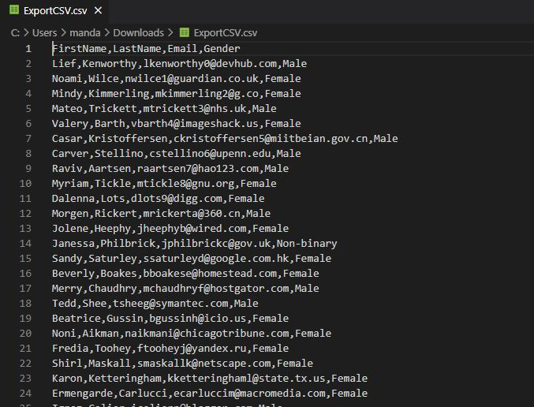
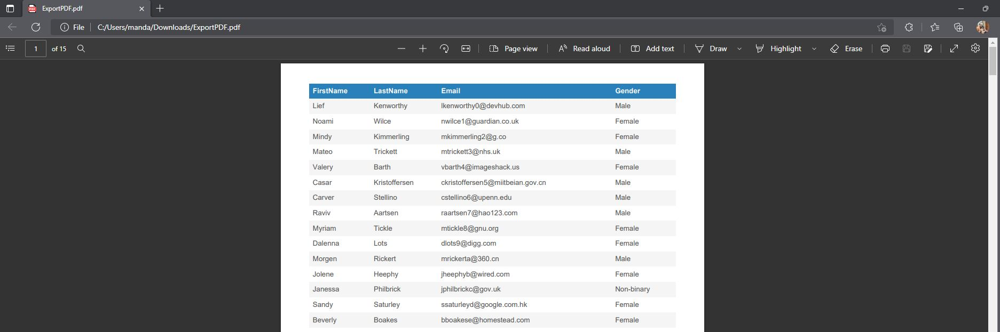
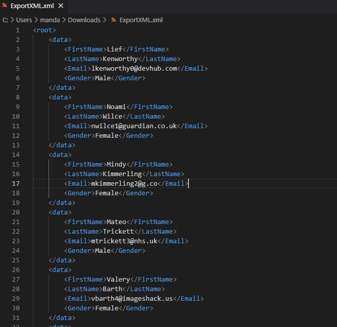

Recently while evaluating a requirement as part of my work, I came across a requirement where the Business Users were asking for a export functionality to be available in the UI to allow the users to export the JSON arrays returned by APIs. While that requirement was for a traditional UI, it gave me the idea to write a PCF component which can do the same thing in a canvas app.

So I present to you the `JsonTableExport` PCF component. This is a virtual PCF component written using `React` and the `Fluent UI` framework used by Microsoft, in order to keep the component experience in line with the general Microsoft 365 suite of products. The component is very simple and looks akin to a button and icon combination. 
Following video shows a sample of how 
* The component looks
* How to configure the component
* How the component works



The power automate returns an array of users in following format.

```JSON
[
    {"FirstName":"Lief","LastName":"Kenworthy","Email":"lkenworthy0@devhub.com","Gender":"Male"},
    {"FirstName":"Noami","LastName":"Wilce","Email":"nwilce1@guardian.co.uk","Gender":"Female"}
]
```

The downloaded files look like below.








That is it that is how the component works !!

The managed solution can be downloaded from the release section of the repository at [Json Table Export Component PCF](https://github.com/codidharma/fluent-ui-json-export-pcf/releases)

The source code for the component canbe found at [fluent-ui-json-export-pcf](https://github.com/codidharma/fluent-ui-json-export-pcf)