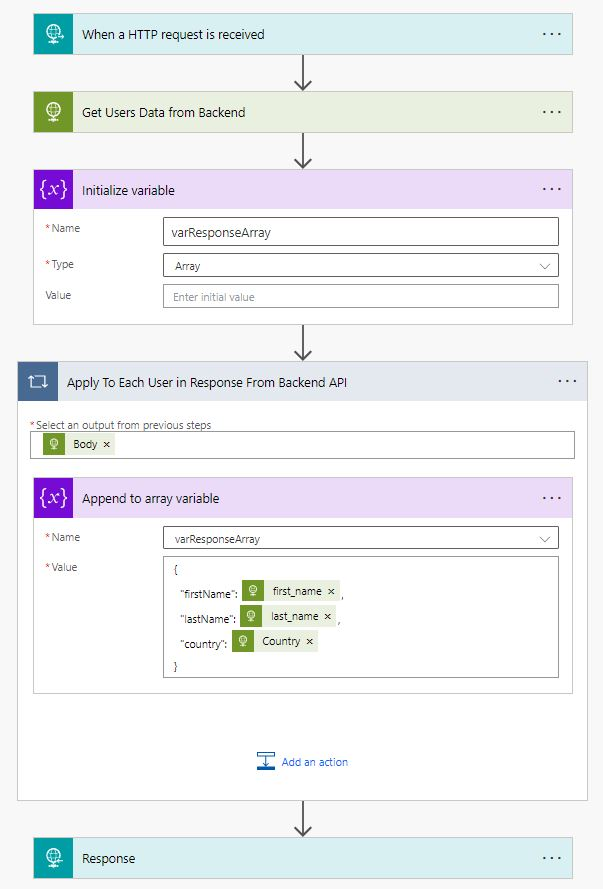
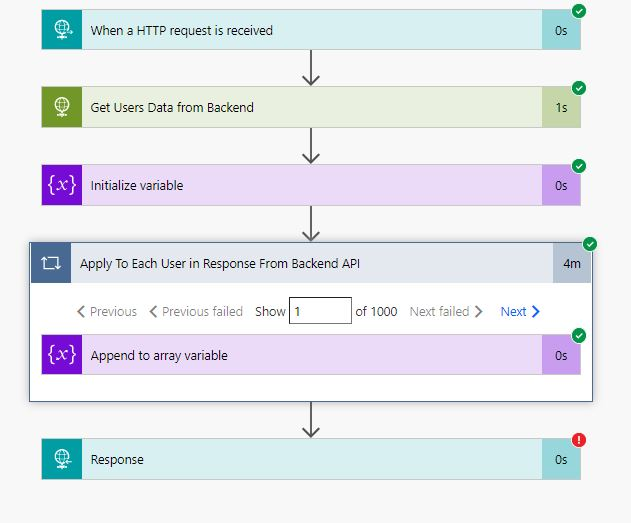
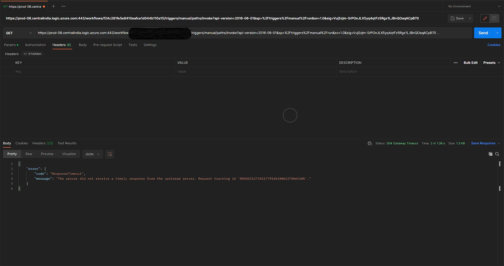
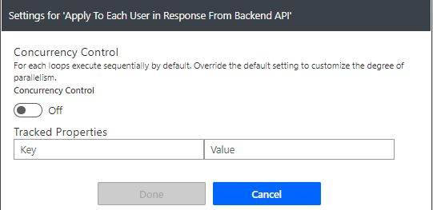
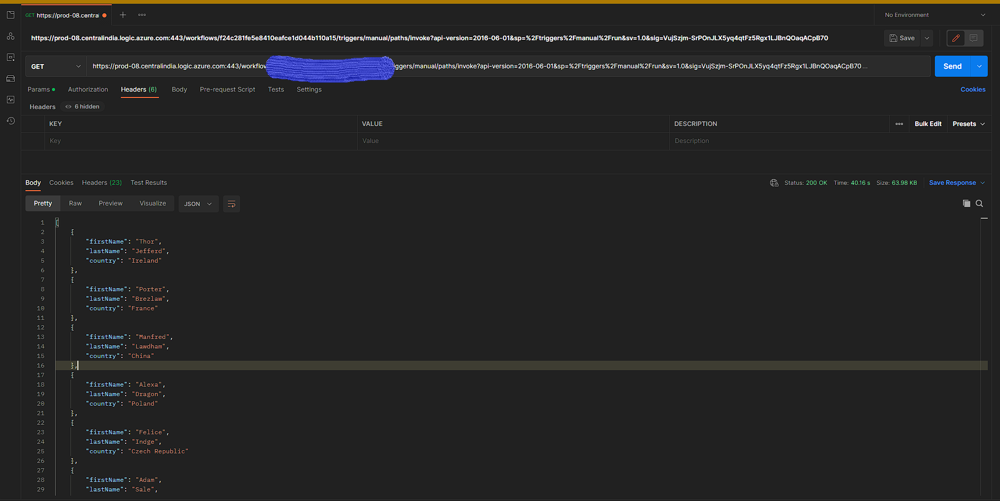
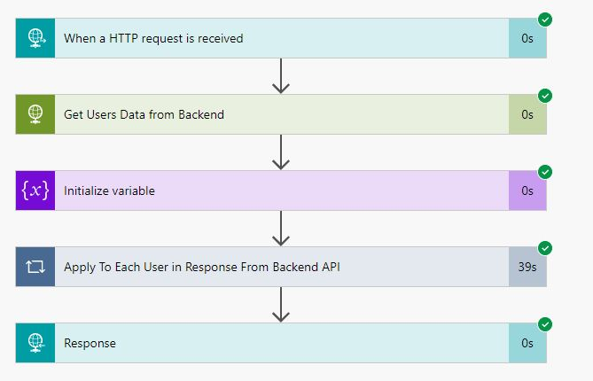
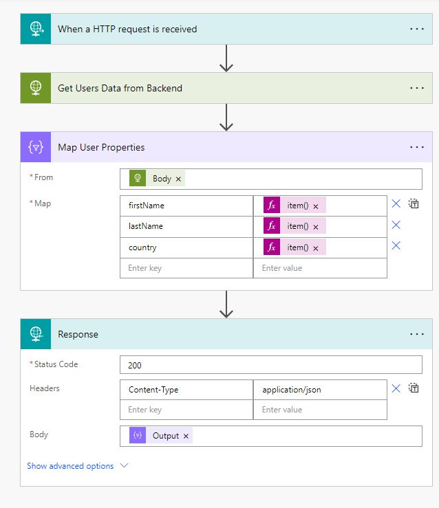
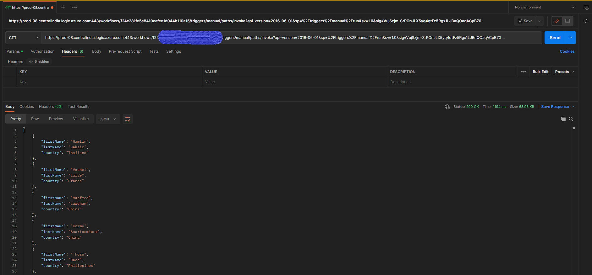
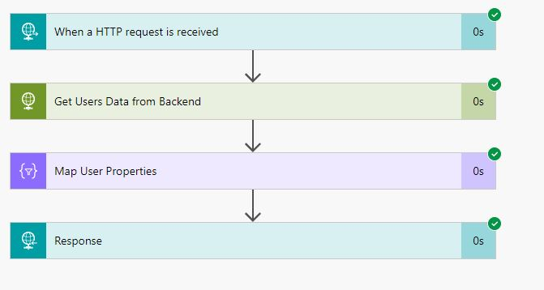

## Background

Few days ago, I was approached by one of the citizens developer with a problem that the flow they were building was timing out and returning a 504 bad gateway error. The business requirement they were working on was as follows
1. There is a backend user information system which stores the users and their details like first name, last names, emails, country etc.
2. The users in the system can be retrieved using an API endpoint which returns all the users
3. The Citizen Developer wanted to retrieve the list of users from the backend via API call and get first name, last name and the country details for all the users.


Based on these requirements the developer built a simple flow as shown below.



The flow was 
1. Triggered by a HTTP GET Call
2. Called the API exposed by the user information system which returned the response in fllowing format
```JSON
[
    {"FirstName":"Lief","LastName":"Kenworthy","Email":"lkenworthy0@devhub.com","Gender":"Male", "Country":"United States"},
    {"FirstName":"Noami","LastName":"Wilce","Email":"nwilce1@guardian.co.uk","Gender":"Female", "Country": "India"}
]
```


3. Went through each of the user in the response array and created a user object by reading `FirstName`, `LastName`, `Country` fields
4. Appended this object to an array variable
5. Returned the updated array of users to the HTTP GET call


After checking a few runs from run history(see one below), I made following straight forward observations



1. The HTTP call to get the users was taking a mere second to return 1000 users
2. The Foreach loop was the real culprit as it was processing 1000 records. It took nearly 4 mins to process the 1000 users
3. Because of this the caller got a timeout with 504 Bad Gateway as the Power Automate closed the connection after time limit of 2 mins or 120 seconds



*Total Processing Time = 242 Seconds*


So what went wrong? If we clearly examine the Settings for the `Apply to Each` loop we will see that the flow by default processes the entries sequentially.



Now I will detail the changes I made sequentially to improve the performance of the flow by reducing the overall execution time.

## Change 1 

Enabled the concurrency control and set the value to maximum allowed of 50 iterations in parallel. 


The flow was run again and produced following result





*Total Processing Time = 39 Seconds*

## Change 2

Removed the `Apply To Each Loop` and `Array Initialization` and `Array Append Actions` and used `Select Action`

The updated flow looked like below



The testing produced following results





*Total Processing Time = 1 Second* 

## Comparison

If we do a comparison of the run times for different approach, we will see the performance update

|Coding Style|Execution Time in Seconds|% Reduction in Execution Time(Compared to Base)|
|----------|--------|-------|
|Iterating Through records Sequentially(Base)|242|0|
|Iterating Through records Concurrently|39|83.88|
|Select Based Mapping|1|99.58|

## Conclusion 

As clear from the comparison, we can reduce the processing times in Power Automate by changing concurrency control on the `Apply to each` loop and improve it further by using the `Select` Action. The `Select` action will give best results out of all the three approaches


