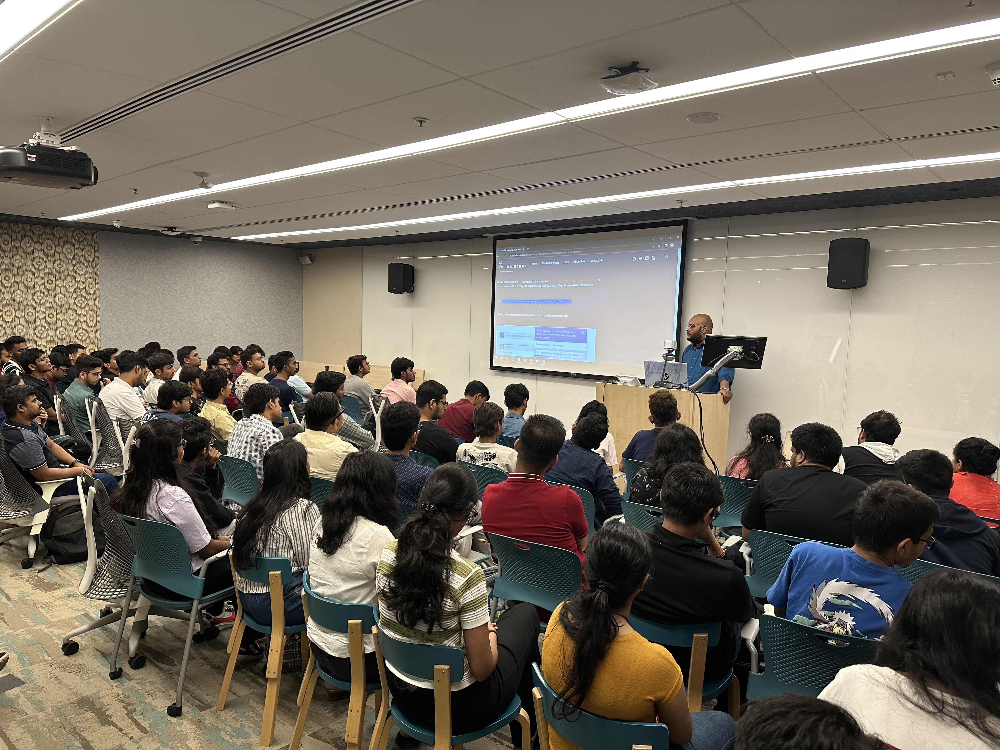

I have a zeal for sharing my learnings with others so that we grow together as one tech community.

# Upcoming Events

---

# Current Talks
- [Upcoming Events](#upcoming-events)
- [Current Talks](#current-talks)
- [Retired Talks](#retired-talks)
- [Past Presentations](#past-presentations)
  - [2023](#2023)
  - [2022](#2022)
  - [2021](#2021)
  - [2020](#2020)
  - [2019](#2019)
- [Talk Details](#talk-details)
  - [To Logic Apps or Power Automate: That is the Question?](#to-logic-apps-or-power-automate-that-is-the-question)
  - [Automating Logic Apps deployment with GitHub Actions](#automating-logic-apps-deployment-with-github-actions)
  - [Deploying .NET Core Web API to Azure App using GitHub Actions](#deploying-net-core-web-api-to-azure-app-using-github-actions)
  - [Modern Day Intelligent Workflows with Azure Logic Apps and Cognitive Services](#modern-day-intelligent-workflows-with-azure-logic-apps-and-cognitive-services)
  - [How to build Event Driven .Net Apps using Serverless Azure Functions](#how-to-build-event-driven-net-apps-using-serverless-azure-functions)
  - [Things you should know about Azure API Management](#things-you-should-know-about-azure-api-management)
  - [Azure Integration Services for .NET Developers](#azure-integration-services-for-net-developers)
  - [How to build a Serverless Helmet detection system using Custom Vision, Azure Functions, Event Grid and Logic Apps](#how-to-build-a-serverless-helmet-detection-system-using-custom-vision-azure-functions-event-grid-and-logic-apps)
  - [Building Intelligent Chat Bots using MS Bot Framework](#building-intelligent-chat-bots-using-ms-bot-framework)
  - [Building Intelligent Chat Bots using MS Bot Framework](#building-intelligent-chat-bots-using-ms-bot-framework-1)
  - [Administering BizTalk Server with a ChatBot](#administering-biztalk-server-with-a-chatbot)

# Retired Talks

* [How to build a Serverless Helmet detection system using Custom Vision, Azure Functions, Event Grid and Logic Apps](#helmetdetection)
* [Building Intelligent Chat Bots using MS Bot Framework](#intelligentchatbots)
* [Administering BizTalk Server with a ChatBot](#administeringbiztalk)
---

# Past Presentations

## 2023
**Global Integration BootcampMumbai, India (March 4th)**
* [Building a Serverless Speeding Infraction System under 60 Minutes](#speedinginfractionapp)

[Global AI Bootcamp 2023, Mumbai](https://globalai.community/bootcamp-2023/asia-india-mumbai-5810/)

## 2022

**Dear Azure Weekly Presentations - Online (November 13th)**
* [Cleaner Business Rules with JSON Rules Engine and Azure Functions](#businessrulesint)


**Dear Azure Weekly Presentations - Online (November 6th)**
* [To Logic Apps or Power Automate: That is the Question?](#laorpa)
  

## 2021

**Dear Azure Weekly Presentations - Online (March 20th)**
* [Deploying .NET Core Web API to Azure App using GitHub Actions](#webapiwithgithubactions)
  

**Global Integration Bootcamp - Online (February 27th)**
* [Automating Logic Apps deployment with GitHub Actions](#lawithgithubactions)

## 2020

**Global AI Tour 2020  - Online (May 17th)**
* [Modern Day Intelligent Workflows with Azure Logic Apps and Cognitive Services](#modernintegrations)
  

**Dear Azure Weekly Presentations - Online (May 17th)**
* [How to build Event Driven .Net Apps using Servless Azure Functions](#eventdrivenazfuncs)
  

**Global Azure Virtual - Online (April 23rd)**
* [Things you should know about Azure API Management](#azapim)
  

**Dear Azure Weekly Presentations - Online (April 16th)**
* [Azure Integration Services for .NET Developers](#azintegrationservices)
  

## 2019

**[Integration User Group](https://www.integrationusergroup.com/)  - Online (October 7th)**
* [How to build a Serverless Helmet detection system using Custom Vision, Azure Functions, Event Grid and Logic Apps](#helmetdetection)
  
  [Recording link](https://www.integrationusergroup.com/how-to-build-a-serverless-helmet-detection-systems)

**Integration Down Under - Adelaide, South Australia (August 11th)**
* [How to build a Serverless Helmet detection system using Custom Vision, Azure Functions, Event Grid and Logic Apps](#helmetdetection)
  

**Dear Azure Weekly Presentations - Online (August 11th)**
* [How to build a Serverless Helmet detection system using Custom Vision, Azure Functions, Event Grid and Logic Apps](#helmetdetection)
  

**Global Azure Bootcamp  - Adelaide,South Australia (April 27th)**
* [Building Intelligent Chat Bots using MS Bot Framework](#intelligentchatbots)
* [Logic Apps for Beginners](#intelligentchatbots)

**Adelaide Azure User Group  - Adelaide,South Australia (April 18th)**
* [Administering BizTalk Server with a ChatBot](#administeringbiztalk)

**Global Integration BootcampMelbourne, Victoria (March 30th)**
* [Administering BizTalk Server with a ChatBot](#administeringbiztalk)

**[Integration User Group](https://www.integrationusergroup.com/)  - Online (January 21th)**

* [Administering BizTalk Server with a ChatBot](#administeringbiztalk)
  
  [Recording link](https://www.integrationusergroup.com/administering-biztalk-server-with-a-chatbot/)

---
# Talk Details

## Through this talk I demonstrate to attendees how easy it is to create and prototype AI infused logic apps workflows even without having prior coding or AI experience.

[back to top](#top)

## Cleaner Business Rules with JSON Rules Engine and Azure Functions
This is an advanced level session which talk about how we can create a serverless rules engine using Open Source JSON rules engine from Microsoft and Azure Functions.

[back to top](#top)

## To Logic Apps or Power Automate: That is the Question?
This is an intermediate level session where I present based on my past experience, the process I use to determine if I should use Logic Apps or Power Automate for a workflow in my project.

[Presentation Slides](https://view.officeapps.live.com/op/view.aspx?src=https%3A%2F%2Fraw.githubusercontent.com%2Fcodidharma%2Fpresentations%2Fmain%2F2022%2FLogicAppsVPowerAutomate.pptx&wdOrigin=BROWSELINK)

[back to top](#top)

## Automating Logic Apps deployment with GitHub Actions
This is a beginner friendly session where I present how GITHUB actions work and how we can use it to set up a proper Continuous deployment for a logic app and how to deploy it to azure.

[Presentation Slides](https://github.com/codidharma/presentations/blob/main/2021/Automating%20Logic%20Apps%20Deployment%20With%20GitHUB%20Actions.pptx)

[back to top](#top)

## Deploying .NET Core Web API to Azure App using GitHub Actions 
This is a beginner friendly session where I present how GITHUB actions work and how we can use it to set up a proper Continuous deployment for a web api and how to deploy it to azure.

[Presentation Slides](https://github.com/codidharma/presentations/blob/main/2021/Automating%20.Net%20Core%20Web%20API%20deployment%20with%20GitHub%20Actions.pptx)

[back to top](#top)

## Modern Day Intelligent Workflows with Azure Logic Apps and Cognitive Services
The session demonstrates how easily and effortlessly we can build integration solutions for modern-day using Logic Apps and Azure Cognitive Services.

[back to top](#top)

## How to build Event Driven .Net Apps using Serverless Azure Functions
This is a advanced session which dives into the topics of event driven programming and how we can use different azure services like Azure Event Grid, Azure Functions etc, to create a reactive solution.

[Presentation Slides](https://github.com/codidharma/presentations/blob/main/2020/Event%20Driven%20.NET%20apps%20with%20Azure%20Function.pptx)

[back to top](#top)

## Things you should know about Azure API Management
The session would demonstrate,

* What are Web APIs and why they are used?
* What does Serverless mean?
* What is Azure serverless APIs?
* What is Azure API Management ?
* What are Azure APIM policies?
* Options to expose the APIs securely.
* Products and subscription scopes for the APIs.
* Developer portal for the APIs.
* And Some best practices..

[Presentation Slides](https://github.com/codidharma/presentations/blob/main/2020/Azure%20API%20Management'.pptx)

[back to top](#top)

## Azure Integration Services for .NET Developers
This session talks about various components that are part of the Azure integration services and why when to use them. It also covers various basic integration design patterns that can be built using these services e.g. queue/topic-based integrations, event-driven integrations, etc

[Presentation Slides](https://github.com/codidharma/presentations/blob/main/2020/Azure%20Integration%20Services.pptx)

[back to top](#top)

## How to build a Serverless Helmet detection system using Custom Vision, Azure Functions, Event Grid and Logic Apps
This session will talk about how we can create a serverless helmet detection app using Custom Vision (Azure Cognitive Service), Event Grid, Azure Functions and Logic Apps. It will briefly touch up on how we can use event grid to create reactive workflows and functions which cater to different aspects of the Helmet Detection system.

[Presentation Slides](https://github.com/codidharma/presentations/blob/main/2019/How%20to%20build%20a%20Serverless%20Helmet%20detection%20system.pptx)

[back to top](#top)

## Building Intelligent Chat Bots using MS Bot Framework
This is a beginner friendly presentation which introduces the participants to the concepts of conversational AI and then explains how one can get started building fun chatbots using MS Botframework and the Azure Cognitive Services. 

[Presentation Slides](https://github.com/codidharma/presentations/blob/main/2019/BuildingIntelligentChatBots.pptx)

[back to top](#top)

## Building Intelligent Chat Bots using MS Bot Framework
This is a beginner friendly presentation which introduces the participants to the azure logic apps and it then talks about some sample integrations and how easy it is build them. 

[Presentation Slides](https://github.com/codidharma/presentations/blob/main/2019/LogicAppsForBeginners.pptx)

[back to top](#top)

## Administering BizTalk Server with a ChatBot

BizTalk is a hybrid integration platform by Microsoft which allows organizations to build robust enterprise level integrations which can connect systems working on disparate languages, platforms etc. This presentation talks about how an organization can get started on building a chat bot solution which can be used by an admin to manage the Microsoft BizTalk server. This presentation shows the concept using Microsoft Botframework SDK.

[back to top](#top)

